# Diagram Generation with Mermaid + ASCII

## Purpose

Generate ASCII/Unicode diagrams for markdown documentation using [Mermaid](https://mermaid.js.org/) syntax with [mermaid-ascii](https://github.com/AlexanderGrooff/mermaid-ascii) converter.

## When to Use

- Creating or updating reactive dependency diagrams
- Documenting data flow in applications
- Visualizing system architecture
- Generating sequence diagrams or flowcharts
- Any diagram that needs to be embedded in markdown as plain text

## Prerequisites

**Install mermaid-ascii (Go binary):**
```bash
# Build and install from source (our fork with multi-line label support)
cd ~/src/mermaid-ascii
go build -o mermaid-ascii .
sudo cp mermaid-ascii /usr/local/bin/

# Verify installation
which mermaid-ascii
mermaid-ascii --help
```

**Note:** We use the Go-based fork with enhanced features including `<br/>` tag support for multi-line labels and `-w/--maxWidth` for width control.

## Step-by-Step Workflow

### Step 1: Create Input File

Create a Mermaid diagram file using standard Mermaid syntax.

**For reactive dependency graphs (flowchart syntax):**
```mermaid
# File: reactive-deps.mmd
# Multi-line labels supported via <br/> or <br> tags
flowchart TD
    input_auto["input$auto_refresh"] --> observer["auto-refresh<br/>observer"]
    input_interval["input$refresh_interval"] --> observer
    observer --> trigger["refresh_trigger()"]
    trigger --> task_data["task_data()"]
    task_data --> main_obs["main observer"]
    force["rv$force_refresh"] --> main_obs
    main_obs --> last_update["rv$last_update"]
    main_obs --> reactives["task_reactives"]
    observer -.->|"LOOP"| trigger
```

**After generation, annotate output:**
```
# Add type information and warnings as external annotations
input$auto_refresh         ← checkbox input
refresh_trigger()          ← reactiveVal, increments every 5 seconds  
task_data()                ← bindEvent(refresh_trigger, rv$force_refresh)
LOOP edge                  ← ⚠️  CRITICAL: Creates infinite reactive cycle
```

**For sequence diagrams:**
```mermaid
# File: process-flow.mmd
sequenceDiagram
    participant Alice
    participant Bob
    Alice->>Bob: Authentication Request
    Bob->>Alice: Authentication Response
    Alice->>Server: Data Request
    Server->>Alice: Data Response
```

**For flowcharts with conditionals:**
```mermaid
# File: decision-flow.mmd
flowchart TD
    A[Check cooldown] --> B{Min 5 sec<br/>elapsed?}
    B -->|Yes| C[Query database<br/>Update status<br/>Return data]
    B -->|No| D[Skip query<br/>Use cached]
```

**For state diagrams:**
```mermaid
# File: reactive-states.mmd
stateDiagram-v2
    [*] --> Idle
    Idle --> Querying: refresh_trigger
    Querying --> Processing: data received
    Processing --> Idle: update complete
    Processing --> Error: query failed
    Error --> Idle: retry
```

### Step 2: Generate Diagram

Run mermaid-ascii to convert Mermaid to ASCII:

```bash
# Default (extended Unicode box-drawing characters)
mermaid-ascii -f reactive-deps.mmd

# Save to file
mermaid-ascii -f reactive-deps.mmd > reactive-deps.txt

# ASCII-only mode (basic characters, better terminal compatibility)
mermaid-ascii -a -f reactive-deps.mmd > reactive-deps.txt

# Control diagram width (auto-enables fitting)
mermaid-ascii -w 80 -f reactive-deps.mmd  # Constrains output to 80 characters wide

# Adjust spacing between nodes
mermaid-ascii -x 8 -y 5 -f reactive-deps.mmd  # More horizontal space (-x), vertical space (-y)

# Increase padding inside boxes
mermaid-ascii -p 2 -f reactive-deps.mmd  # Default padding is 1
```

### Step 3: Review and Annotate Output

Open the generated `.txt` file and add annotations:

```bash
# View the output
cat reactive-deps.txt

# Or edit directly
code reactive-deps.txt
```

**Add labels and warnings:**
```
┌─────────────────┐
│ refresh_trigger │ ← Timer-based increment
└────────┬────────┘
         │
         ▼
   ┌───────────┐
   │ task_data │ ⚠️  REACTIVE SOURCE
   └─────┬─────┘
         │
         ▼
   ┌──────────┐
   │ observer │
   └────┬─────┘
        │
        └─────────────┐ ⚠️  REACTIVE LOOP!
                      │
         ┌────────────┘
         ▼
┌─────────────────┐
│ refresh_trigger │
└─────────────────┘
```

### Step 4: Embed in Markdown

Wrap the diagram in a markdown code block:

````markdown
## Reactive Dependency Flow

```
┌─────────────────┐
│ refresh_trigger │ ← Timer-based increment
└────────┬────────┘
         │
         ▼
    ┌────────┐
    │task_data│ ⚠️  REACTIVE SOURCE
    └────┬───┘
         │
         ▼
   ┌─────────┐
   │ observer│
   └────┬────┘
        │
        └─────────────┐ ⚠️  REACTIVE LOOP!
                      │
         ┌────────────┘
         ▼
┌─────────────────┐
│refresh_trigger  │
└─────────────────┘
```
````

### Step 5: Add Context and Analysis

Always include explanatory text around diagrams:

```markdown
## Identified Problems

1. **CRITICAL: Reactive Loop** - The `auto_refresh_observer` creates an infinite loop:
   - `invalidateLater()` triggers every flush cycle
   - Instead of waiting 5 seconds, fires every 30-50ms
   - Solution: Use `isolate()` or `reactiveTimer()`

2. **Observer Self-Dependency** - Main observer depends on `rv$last_update` which it modifies
   - Creates additional reactive cycles
   - Solution: Isolate the check with `isolate(rv$last_update)`
```

### Step 6: Maintain Source Files

Keep the `.mmd` Mermaid files for easy regeneration:

```bash
# Directory structure
inst/docs/
  reactive-dependencies.md     # Final markdown with embedded diagram
  diagrams/
    reactive-deps.mmd           # Source Mermaid file
    reactive-deps.txt           # Generated ASCII diagram (can be regenerated)
```

**Add regeneration instructions to markdown:**

```markdown
<!-- Diagram Source: inst/docs/diagrams/reactive-deps.mmd -->
<!-- Regenerate with: mermaid-ascii -f reactive-deps.mmd > reactive-deps.txt -->
<!-- Note: Supports <br/> tags for multi-line labels, use -w flag to control width -->
```

## Known Limitations

**mermaid-ascii limitations:**

1. **Multi-line labels now supported** - Use `<br/>` or `<br>` tags in node labels ✅
   - Example: `A["First<br/>Second"]` renders as two lines
   - Works in node labels; edge label support may vary

2. **Width constraint flips direction** - `-w` flag may change LR→TD instead of multi-row wrapping
   - Future enhancement planned (see TODO in `cmd/fit_graph.go`)
   - Current workaround: Use wider width or allow direction flip

3. **Subgraphs not supported** - mermaid-ascii doesn't handle `subgraph` syntax well ❌
   - Output becomes garbled with nested subgraphs
   - **Workaround: Compositional/Recursive approach** (see below)

## Advanced: Compositional Diagrams

For complex hierarchical diagrams, use a compositional approach where you build subcomponents separately and assemble them manually:

### Step 1: Create Component Diagrams

Break your diagram into logical components:

```bash
# parts/timer-cycle.mmd
flowchart TD
    timer["invalidateLater(5000)"]
    obs["observe()[auto-refresh]"]
    action["refresh_trigger(n+1)"]
    timer --> obs --> action

# parts/task-data.mmd
flowchart TD
    trigger["refresh_trigger()"]
    task["task_data()"]
    mods["MODIFIES:<br/>rv$query_running"]
    trigger --> task --> mods
```

### Step 2: Generate ASCII for Each Component

```bash
cd parts
mermaid-ascii -a -f timer-cycle.mmd > timer-cycle.txt
mermaid-ascii -a -f task-data.mmd > task-data.txt
```

### Step 3: Manually Compose the Full Diagram

Create the final diagram by embedding the generated ASCII within larger boxes:

```text
REACTIVE DEPENDENCY DIAGRAM
═══════════════════════════════════════════════════════════════

TIMER-BASED CYCLE (Main Loop):
┌─────────────────────────────────────────────────────────────┐
│ +-----------------------+                                    │
│ | invalidateLater(5000) |                                    │
│ +-----------------------+                                    │
│            |                                                 │
│            v                                                 │
│ +-----------------------+                                    │
│ |   observe()           |                                    │
│ |   [auto-refresh]      |                                    │
│ +-----------------------+                                    │
│            |                                                 │
│            v                                                 │
│ +-----------------------+                                    │
│ | refresh_trigger(n+1)  |                                    │
│ | ← WRITES              |                                    │
│ +-----------------------+                                    │
└─────────────────────────────────────────────────────────────┘
                    │
                    v
┌─────────────────────────────────────────────────────────────┐
│ task_data() ← reactive({...})                                │
│ [Generated component embedded here]                          │
└─────────────────────────────────────────────────────────────┘
```

### Benefits of Compositional Approach:

- ✅ Generates clean diagrams for each component
- ✅ Full control over layout and annotations
- ✅ Can mix generated and hand-crafted elements
- ✅ Components can be reused across different diagrams
- ✅ Easier to maintain complex hierarchical structures

### When to Use:

- **Simple diagrams**: Use direct mermaid-ascii generation
- **Complex hierarchical diagrams**: Use compositional approach
- **Diagrams with rich annotations**: Hand-craft with optional generated components
   - **Workaround:** Keep edge labels short, use external annotations

3. **Complex layouts** - Very large diagrams may have overlapping nodes
   - **Workaround:** Break into multiple smaller diagrams, adjust spacing with `-x` and `-y`

4. **Emoji rendering** - Some Unicode characters may display as garbled
   - **Workaround:** Use ASCII-only mode (`-a`) or avoid emoji in Mermaid source

5. **Styling ignored** - CSS classes and styling in Mermaid not translated to ASCII
   - **Expected:** ASCII output is plain text, no colors or styles

**Best practices:**
- Keep node names concise (1-3 words)
- Use external annotations for detailed information
- Test layout with simple diagram first
- Adjust spacing if nodes overlap (`-x` and `-y` flags)

## Best Practices

### Mermaid Syntax Tips

**Use descriptive node IDs with display text:**
```mermaid
# ✅ GOOD - Separate ID and display text
flowchart TD
    trigger["refresh_trigger<br/>(reactiveVal)"]
    observer["main observer"]
    trigger --> observer

# ❌ BAD - Node ID used as display (less flexible)
flowchart TD
    refresh_trigger --> main_observer
```

**Multi-line text attempts (LIMITATION: mermaid-ascii doesn't process `<br/>`):**
```mermaid
# ⚠️  WARNING: mermaid-ascii shows <br/> literally, doesn't create line breaks
# Use single-line node names instead, add details as external annotations

flowchart TD
    A["Check cooldown"]
    B["Query database"]
    A --> B
    
# Better approach: Simple names + external annotations after generation
```

**Styling for emphasis:**
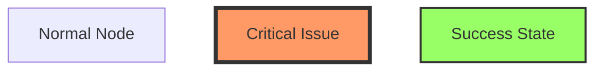

**Note:** Styling may not translate perfectly to ASCII, but structure will remain.

### Group Related Nodes

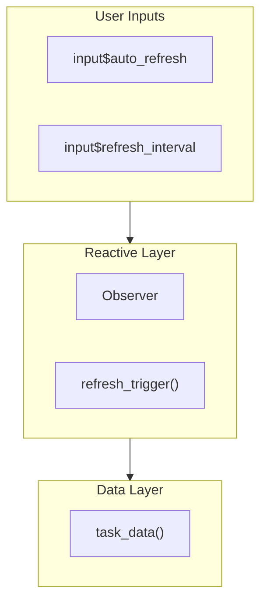

### Annotation Guidelines

**Mark reactive sources after generation:**
```
│task_data│ ← REACTIVE SOURCE (bindEvent)
```

**Highlight problems:**
```
│ observer │
└─────┬────┘
      │
      └───────┐ ⚠️  REACTIVE LOOP - FIX WITH isolate()
              │
```

**Document decisions:**
```
│ cooldown │
└────┬─────┘
     │ ✓ Prevents flooding (5 second minimum)
     ▼
```

### Mermaid Diagram Types

**flowchart** - Best for reactive dependencies, data flow, conditional logic
- Direction: `TD` (top-down), `LR` (left-right), `RL`, `BT`
- Node shapes: `[]` rectangle, `()` rounded, `{}` diamond, `(())` circle
- Arrows: `-->` solid, `-.->` dotted, `==>` thick
- Good for most use cases

**sequenceDiagram** - Best for temporal flow, user interactions
- Shows order of operations over time
- Supports activation boxes, notes, loops
- Perfect for debugging timing issues

**stateDiagram-v2** - Best for state machines
- Shows state transitions
- Supports composite states
- Good for lifecycle documentation

**classDiagram** - Best for object relationships (less common for reactive flows)

**gitGraph** - For branching/merging visualizations (Git workflows)

## Common Patterns

### Reactive Dependency Graph

**Input (reactive-deps.mmd):**
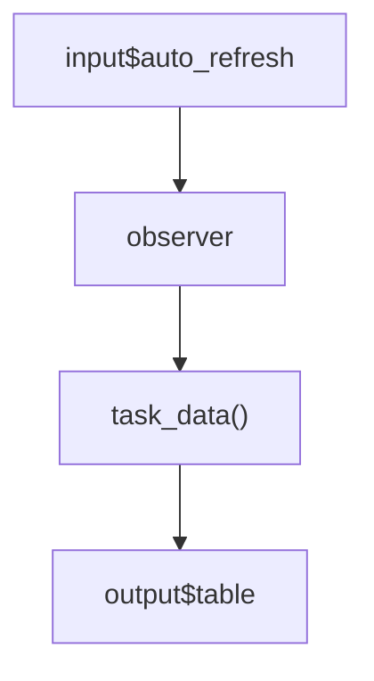

**Generate:**
```bash
mermaid-ascii --unicode reactive-deps.mmd > reactive-deps.txt
```

### Multiple Component Systems with Subgraphs

**Input (system-arch.mmd):**
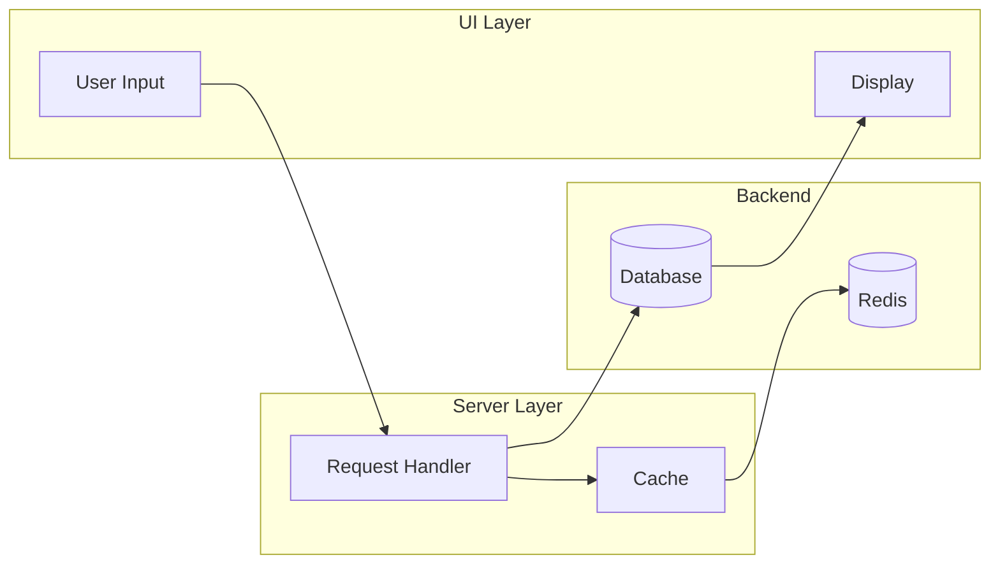

**Generate:**
```bash
mermaid-ascii --unicode --width 100 system-arch.mmd > system-arch.txt
```

### Complex Reactive Flow with Cycles

**Input (reactive-flow.mmd):**
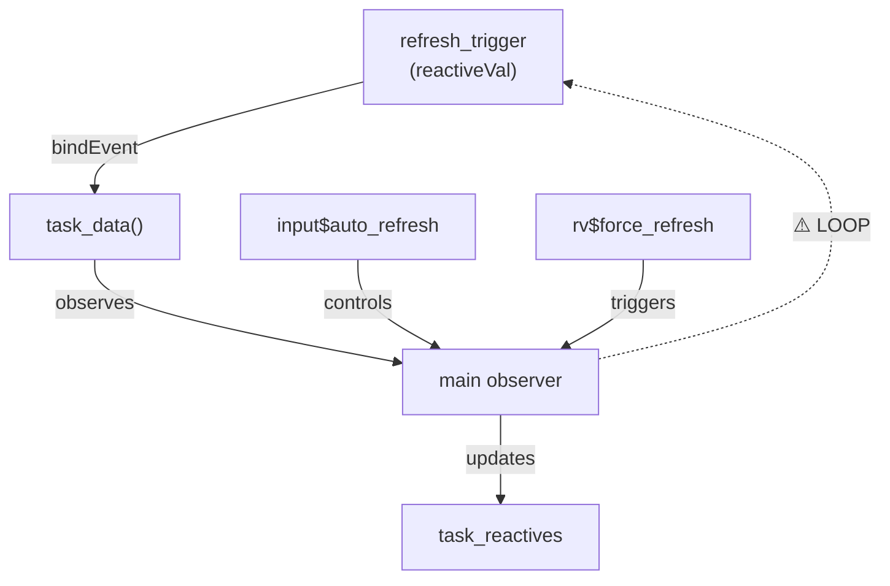

**Generate with wider output:**
```bash
mermaid-ascii --unicode --width 120 reactive-flow.mmd > reactive-flow.txt
```

## Troubleshooting

### Layout Issues

**Problem:** Overlapping nodes or unclear flow

**Solution 1:** Adjust diagram direction
```mermaid
# Try different orientations
flowchart TD  # Top-down (default)
flowchart LR  # Left-right (better for wide diagrams)
flowchart RL  # Right-left
flowchart BT  # Bottom-top
```

**Solution 2:** Use subgraphs to organize
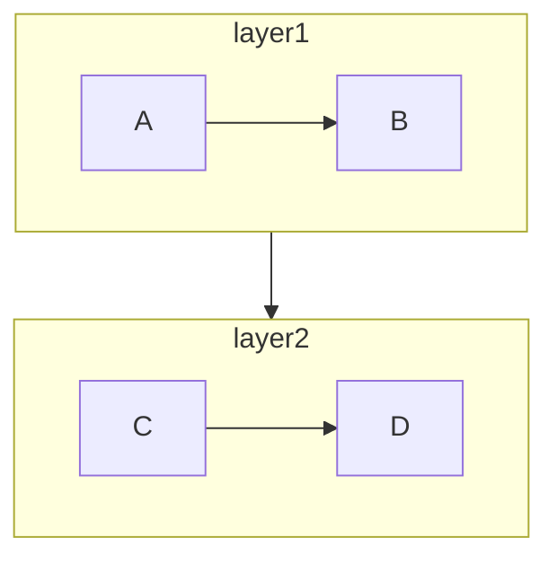

**Solution 3:** Break into multiple focused diagrams

### ASCII Output Quality

**Problem:** ASCII output looks crude or unclear

**Solutions:**
```bash
# Use Unicode for prettier box-drawing characters
mermaid-ascii --unicode diagram.mmd

# Adjust width for better layout
mermaid-ascii --width 100 diagram.mmd  # Narrower
mermaid-ascii --width 140 diagram.mmd  # Wider

# Combine options
mermaid-ascii --unicode --width 120 diagram.mmd
```

### Unicode Rendering in Editor

**Problem:** Boxes look misaligned in editor

**Solution:** Use monospace font (Courier New, Consolas, Fira Code, Monaco)
- VS Code: Settings → Editor: Font Family → Use monospace font
- Terminal: Configure terminal font to monospace

### Mermaid Syntax Errors

**Problem:** mermaid-ascii fails with parse error

**Solution:** Test syntax first using Mermaid Live Editor
1. Visit https://mermaid.live/
2. Paste your Mermaid code
3. Fix syntax errors until it renders
4. Copy corrected code to `.mmd` file
5. Generate ASCII with mermaid-ascii

### Cycle Detection

**Problem:** Circular dependencies create confusing diagrams

**Solution:** Use different arrow styles to indicate cycles
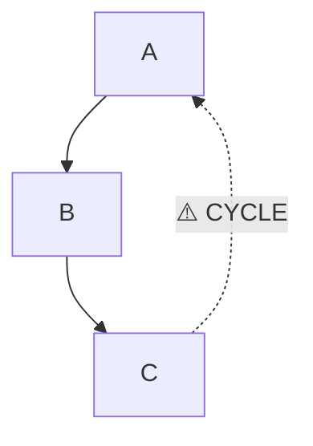

Then annotate in markdown with solution:
```markdown
⚠️ **CRITICAL:** This cycle causes infinite reactive loops.
**Solution:** Use `isolate()` to break the C → A dependency.
```

### Multi-line Text Not Showing

**Problem:** `<br/>` tags not creating line breaks

**Cause:** mermaid-ascii doesn't process HTML tags - shows them literally

**Solution:** Use single-line node names, add details as external annotations
```mermaid
# ❌ DOESN'T WORK - <br/> shown literally
flowchart TD
    A["Long description<br/>with multiple lines<br/>and details"]

# ✅ WORKS - Simple label + external annotation
flowchart TD
    A["refresh_trigger"]
# Then annotate after generation: 
# A ← reactiveVal, increments every 5 seconds
```

**Alternative:** Use descriptive edge labels instead
```mermaid
flowchart TD
    trigger --> task_data
    trigger -->|"Increments every 5 sec<br/>via invalidateLater()"| task_data
# Edge labels may render better than node multi-line text
```

## Integration with Code Review

**Before finalizing diagrams:**

1. **Verify accuracy** - Does diagram match actual code?
2. **Check completeness** - Are all critical dependencies shown?
3. **Validate annotations** - Are problems clearly marked?
4. **Test regeneration** - Can diagram be recreated from source file?
5. **Document source** - Is `.mmd` file committed?

**Add to documentation:**
```markdown
## Maintenance

This diagram was generated using Mermaid + mermaid-ascii. To update:

1. Edit source: `inst/docs/diagrams/reactive-deps.mmd`
2. Regenerate: `mermaid-ascii --unicode reactive-deps.mmd > reactive-deps.txt`
3. Copy output into this markdown file
4. Add annotations (⚠️, ✓, arrows) as needed
5. Update analysis sections if dependencies changed
```

## Examples

### Example 1: Simple Reactive Flow

**Input (simple-flow.mmd):**
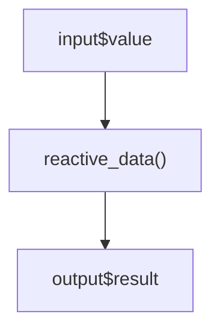

**Command:**
```bash
mermaid-ascii --unicode simple-flow.mmd
```

**Expected output:** Simple top-down flow with three boxes connected by arrows.

### Example 2: Parallel Processing Flow

**Input (parallel-flow.mmd):**
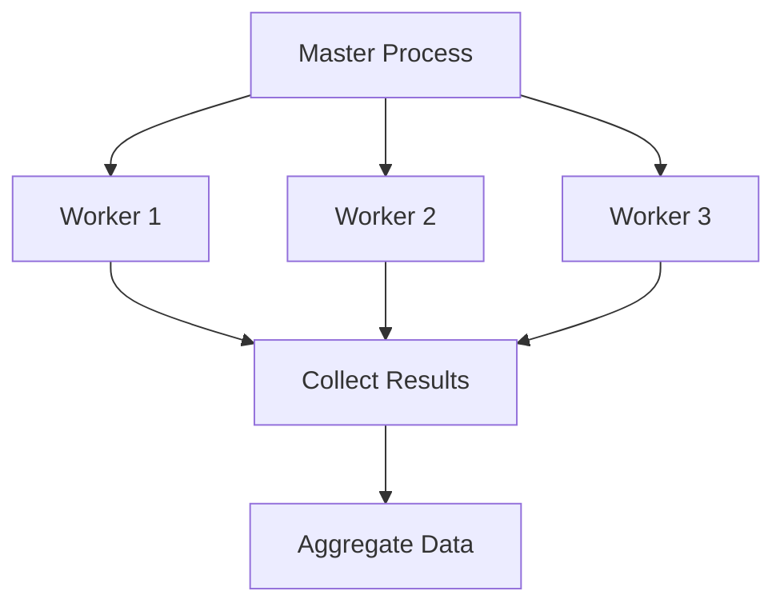

**Command:**
```bash
mermaid-ascii --unicode --width 100 parallel-flow.mmd
```

### Example 3: Conditional Logic

**Input (conditional.mmd):**
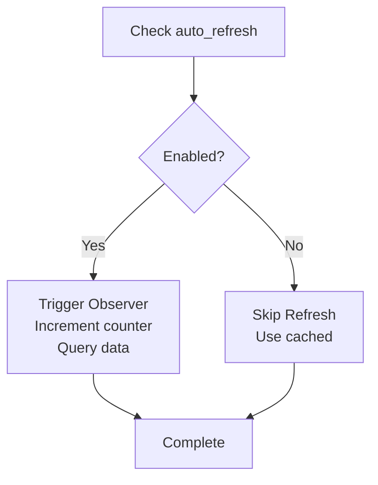

**Command:**
```bash
mermaid-ascii --unicode conditional.mmd
```

### Example 4: Sequence Diagram

**Input (interaction.mmd):**
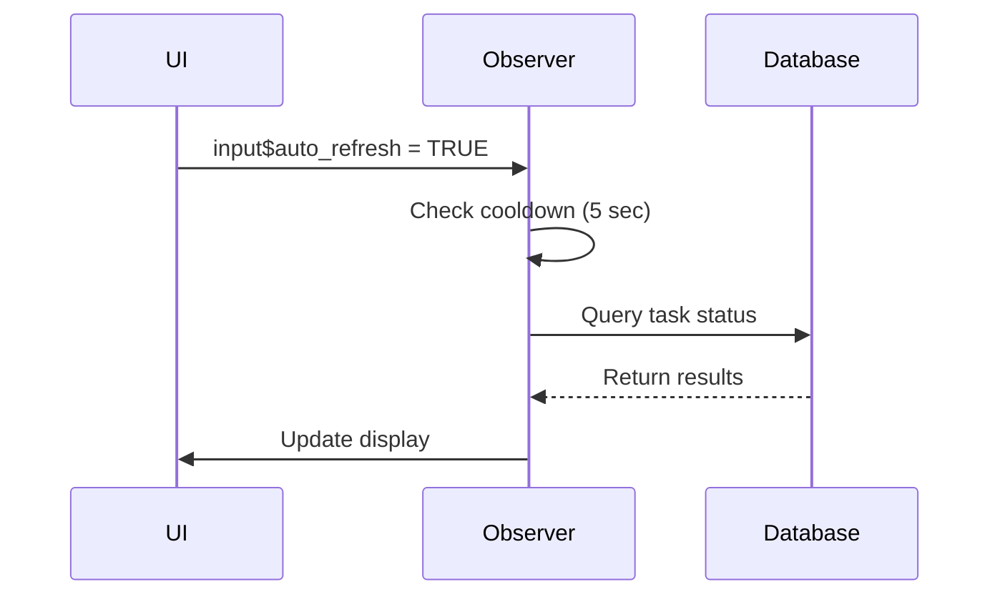

**Command:**
```bash
mermaid-ascii --unicode interaction.mmd
```

### Example 5: State Machine

**Input (states.mmd):**
```mermaid
stateDiagram-v2
    [*] --> Idle
    Idle --> Querying: refresh triggered
    Querying --> Processing: data received
    Processing --> Idle: success
    Processing --> Error: failure
    Error --> Idle: retry
    Error --> [*]: max retries
```

**Command:**
```bash
mermaid-ascii --unicode states.mmd
```

## References

- **Mermaid Documentation:** https://mermaid.js.org/
- **Mermaid Live Editor:** https://mermaid.live/ (test syntax online)
- **mermaid-ascii GitHub:** https://github.com/AlexanderGrooff/mermaid-ascii
- **Flowchart Syntax:** https://mermaid.js.org/syntax/flowchart.html
- **Sequence Diagrams:** https://mermaid.js.org/syntax/sequenceDiagram.html
- **State Diagrams:** https://mermaid.js.org/syntax/stateDiagram.html

## Checklist

Before completing diagram generation:

- [ ] Mermaid source file created with clear syntax (`.mmd` extension)
- [ ] Syntax validated using Mermaid Live Editor (https://mermaid.live/)
- [ ] Diagram generated with `mermaid-ascii --unicode`
- [ ] Output width adjusted if needed (`--width N`)
- [ ] Output reviewed for layout and readability
- [ ] Annotations added (⚠️, ✓, arrows, labels) after generation
- [ ] Embedded in markdown with proper code block
- [ ] Context and analysis sections written around diagram
- [ ] Source `.mmd` file saved in `inst/docs/diagrams/`
- [ ] Regeneration instructions documented in markdown comment
- [ ] Diagram accuracy verified against actual code
- [ ] Maintenance instructions added to documentation
